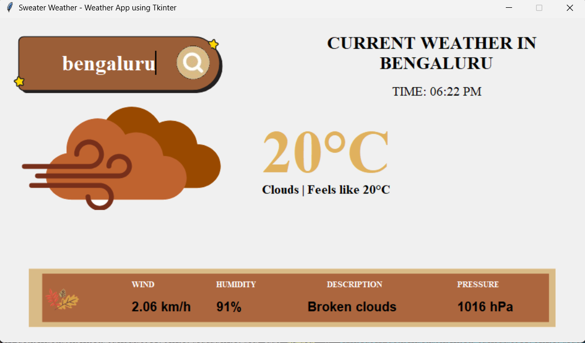

# Sweater Weather - Weather App

Sweater Weather is a simple weather application built using Python's Tkinter library. It fetches real-time weather data using the OpenWeatherMap API and displays details such as temperature, humidity, wind speed, and more for a specific location.

## Features

- Real-time weather updates.
- User-friendly graphical interface.
- Displays weather conditions, temperature, wind speed, humidity, pressure, and a brief description of the weather.
- Automatically converts temperature from Kelvin to Celsius.

## Prerequisites

Before running the app, make sure you have the following installed:

- Python 3.x
- Required Python libraries: `tkinter`, `geopy`, `timezonefinder`, `requests`, `pytz`

You can install the required libraries using:

```bash
pip install geopy timezonefinder requests pytz
```

## How to Run

1. Clone or download this repository.
2. Ensure all required images (`searchBar.png`, `search_icon.png`, `logo.png`, `Bottom.png`) are in the same directory as the script.
3. Replace the placeholder `<API_KEY>` in the script with your OpenWeatherMap API key.
4. Run the script using:

```bash
python weather.py
```

## Final Output:




## Source

i used a small video as reference and made my own modifications accordingly

[Source Video](https://youtu.be/NCCYWIzN6hU?si=iFMrpSYVp_nB0kvc)

## Usage

1. Enter a city name in the search bar.
2. Press the search icon.
3. The app will display the current weather conditions for the specified city.

## Notes

- Ensure you have an active internet connection while using the app.
- If the location is not found, an error message will be displayed.
- If you encounter an issue, double-check your API key and ensure it is valid.
